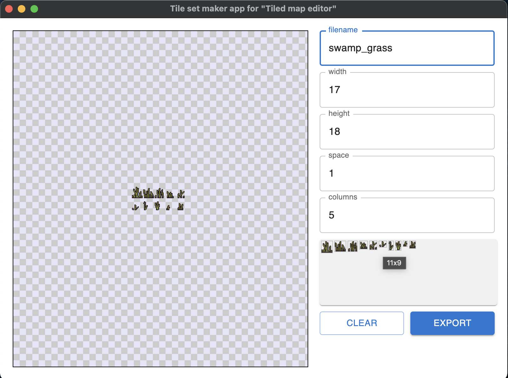

#Tile set maker app for 'Tiled map editor'

Converts a set of some images of different sizes into a set of tiles of the same size with the specified margins for use in the [Tiled map editor](https://www.mapeditor.org/).

Opportunities:
- automatically determines the size of tiles
- setting margins between tiles
- exports to png
- creates a json description of tileset for [Tiled map editor](https://www.mapeditor.org/)

